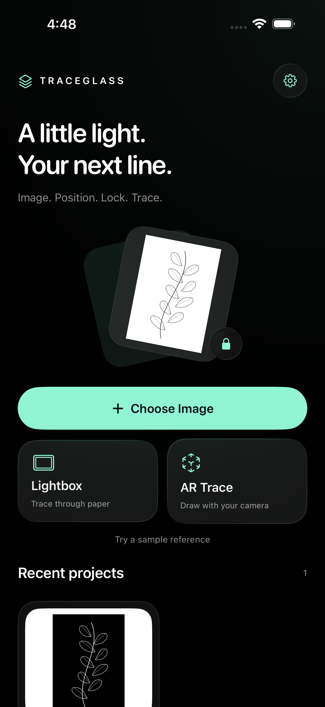
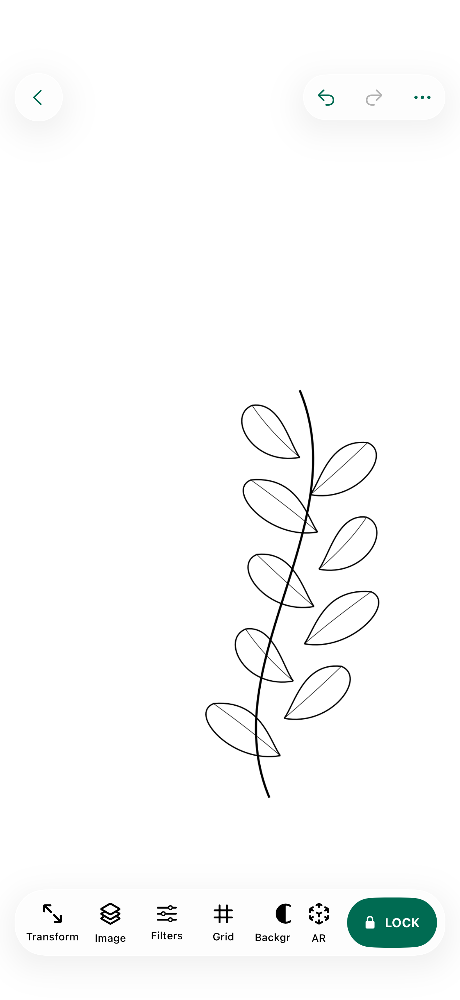
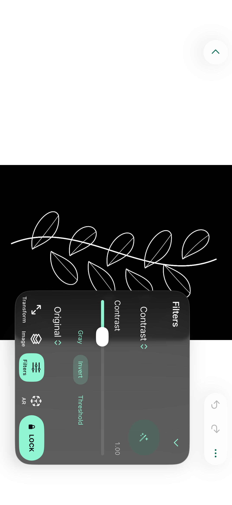

# TraceGlass

**Бесплатное нативное приложение для обводки рисунков на iPhone.**

[English](README.en.md) · [Скачать IPA](https://github.com/Quixylon/TraceGlass/releases/latest) · [Установка с Windows](INSTALL_WINDOWS.md) · [Что нового](CHANGELOG.md)


[](https://github.com/Quixylon/TraceGlass/actions/workflows/ios.yml)

**Без подписки, рекламы, встроенных покупок и платных функций.** Исходники и официальные IPA-релизы доступны бесплатно под лицензией MIT. Это самостоятельный проект Quixylon, не связанный с одноимёнными или похожими приложениями в App Store. Покупать приложение в App Store не нужно.

## Рисунок → положение → Lock → обводка

Загрузи изображение, подгони размер и положение, настрой линии и нажми **LOCK**. В Lightbox положи бумагу поверх экрана и обводи. Пока рисунок заблокирован, приложение не принимает изменения его положения, масштаба, поворота или настроек. Для продолжения редактирования удерживай маленький замок.

<table>
<tr><td></td><td></td></tr>
</table>

Скриншоты реального интерфейса из тестового запуска в iOS Simulator.

## Два способа рисовать

| Режим | Как работает |
|---|---|
| **Lightbox** | Экран подсвечивает рисунок через лежащий на нём лист. Жесты помогают разместить изображение; Lock фиксирует кадр. |
| **Paper Track** | Камера видит бумагу, Vision отслеживает её углы, reference накладывается с учётом перспективы. |
| **World Anchor** | ARKit закрепляет reference на найденной поверхности: холсте, стене или столе. |

AR — изображение поверх камеры **на экране телефона**. iPhone не проецирует рисунок светом на бумагу. Для AR смотри на экран; для Lightbox бумага лежит непосредственно на дисплее.

## Возможности v1.0.0

- **Импорт:** Photos, Files, Camera, Clipboard, PNG/JPEG/HEIC и отдельные страницы PDF; прозрачность PNG сохраняется.
- **Размещение:** одновременные drag/pinch/rotation, зеркалирование, Fit/Fill/Center/1:1, Snap, undo/redo.
- **Фиксация:** защита на уровне модели и обработчиков, неподвижный снимок canvas, Hold to Unlock, отключение сна на время сеанса.
- **Подготовка изображения:** яркость, контраст, экспозиция, grayscale, invert, threshold, edges, cleanup, автоматическая подготовка и редактируемые пресеты.
- **Работа с рисунком:** Before/After, до пяти слоёв, crop, исправление перспективы, фоны, сетки и направляющие.
- **Физический размер:** ручная калибровка линейкой, размеры бумаги, перенос большого рисунка частями с overlap.
- **AR:** автоматические и ручные углы бумаги, сглаживание трекинга, Stability, Ghost, Reference ON/OFF, Overhead; опциональная person occlusion в World Anchor.
- **Интерфейс:** Liquid Glass на iOS 26+, Metal-переходы из Lightbox в AR и обратно, отдельная landscape-компоновка, VoiceOver и Reduce Motion.
- **Проекты:** локальное автоматическое сохранение, последние проекты, восстановление настроек, никаких аккаунтов.



Полный перечень: [FEATURES.md](FEATURES.md).

## Скачать и установить

1. Открой [последний релиз](https://github.com/Quixylon/TraceGlass/releases/latest) и скачай **TraceGlass.ipa** из **Assets**.
2. Подпиши и установи её **своим Apple Account** через Sideloadly или AltStore.
3. Открой TraceGlass → **Choose Image** → настрой рисунок → **LOCK**.

[Короткая инструкция для Windows](INSTALL_WINDOWS.md). IPA намеренно unsigned: в ней нет чужого Apple Account. Это Release для физического iPhone, arm64 / iPhoneOS. Требования Apple к подписи и её обновлению не являются платной функцией TraceGlass.

## Требования и честный статус

| Параметр | Значение |
|---|---|
| Устройство | iPhone с iOS 17+ |
| Нативный Liquid Glass | iOS 26+; на старых системах — публичный системный материал |
| Язык интерфейса | Английский |
| Для сборки из исходников | macOS, Xcode 26+ и iPhoneOS SDK |
| Сервер / интернет для обработки | Не нужны |
| App version | 1.0.0, build 1 |

Базовый код прошёл **17 XCTest/XCUITest** на iPhone 17 Pro Max Simulator с iOS 26.2, включая фиксацию после касаний, Hold to Unlock, повторное открытие проекта и landscape. Каждый релиз проходит новую device-сборку и тесты перед публикацией. В релизе приложены логи, xcresult, скриншоты и SHA-256.

**Физический iPhone ещё нужен для проверки реального AR, установки после resign и производительности 120 FPS.** Lock не отключает системные жесты iOS. На пустой бумаге, при бликах, перекрытии углов или быстрых движениях AR может терять привязку. Превью ограничено 2560 пикселями по длинной стороне; исходные файлы сохраняются без изменения. [Все ограничения](KNOWN_LIMITATIONS.md).

## Конфиденциальность

Изображения и проекты остаются на iPhone. Core Image, Vision и ARKit работают локально. Нет загрузки фотографий, внешней аналитики, облачной обработки, регистрации или сервера. PhotosPicker предоставляет выбранные изображения; камера запрашивается только для соответствующей функции.

## Собрать самостоятельно

```bash
bash scripts/build_ipa.sh
```

Результат: `artifacts/TraceGlass.ipa`. Скрипт выполняет чистую Release-сборку для `iphoneos`, проверяет arm64 и Mach-O `PLATFORM_IOS`, Assets.car и скомпилированные Metal-шейдеры. Подмена simulator binary исключается проверкой бинарника.

```bash
bash scripts/test_ios.sh
```

Открывай `TraceGlass.xcodeproj` напрямую — XcodeGen и сторонние runtime-пакеты не нужны. CI в `.github/workflows/ios.yml` собирает, тестирует и публикует новый `v<VERSION>` после успешного push в `main`. Существующие теги не перезаписываются.

## Документация и участие

[Архитектура](ARCHITECTURE.md) · [Возможности](FEATURES.md) · [Ограничения](KNOWN_LIMITATIONS.md) · [История версий](CHANGELOG.md) · [Вклад в проект](CONTRIBUTING.md) · [MIT License](LICENSE)

Нашёл ошибку — создай Issue с моделью iPhone, версией iOS и шагами воспроизведения. Не прикладывай личные фотографии или данные Apple Account.
